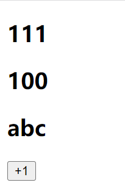
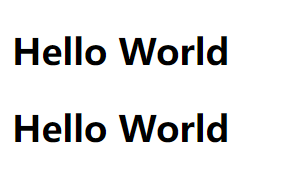
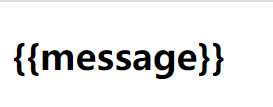

## 4.1 Mustache 语法


Mustache语法(双大括号)的文本插值

- ==data返回的对象==是有添加到==Vue的响应式系统==中； 
- 当==data中的数据发生改变==时，==对应的内容也会发生更新==。 
- 当然，Mustache中不仅仅可以是data中的属性，也可以是一个==JavaScript的表达式==。


**示例**：

```html
<!DOCTYPE html>
<html lang="en">
<head>
  <meta charset="UTF-8">
  <meta http-equiv="X-UA-Compatible" content="IE=edge">
  <meta name="viewport" content="width=device-width, initial-scale=1.0">
  <title>Document</title>
</head>
<body>
  
  <div id="app"></div>

  <template id="my-app">
    <!-- 1.mustache的基本使用 -->
    <h2>{{message}} - {{message}}</h2>
    <!-- 2.是一个表达式 -->
    <h2>{{counter * 10}}</h2>
    <h2>{{ message.split(" ").reverse().join(" ") }}</h2>
    <!-- 3.也可以调用函数 -->
    <!-- 可以使用computed(计算属性) -->
    <h2>{{getReverseMessage()}}</h2>
    <!-- 4.三元运算符 -->
    <h2>{{ isShow ? "哈哈哈": "" }}</h2>
    <button @click="toggle">切换</button>

    <!-- 错误用法 -->
    <!-- var name = "abc" -> 赋值语句 -->
    <!-- <h2>{{var name = "abc"}}</h2>
    <h2>{{ if(isShow) {  return "哈哈哈" } }}</h2> -->
  </template>

  <script src="../js/vue.js"></script>
  <script>
    const App = {
      template: '#my-app',
      data() {
        return {
          message: "Hello World",
          counter: 100,
          isShow: true
        }
      },
      methods: {
        getReverseMessage() {
          return this.message.split(" ").reverse().join(" ");
        },
        toggle() {
          this.isShow = !this.isShow;
        }
      }
    }

    Vue.createApp(App).mount('#app');
  
  </script>
</body>
</html>
```


## 4.2 v-once指令


- **v-once用于指定元素或者组件只渲染一次**：

1. 当数据发生变化时，元素或者组件以及其所有的子元素将视为静态内容并且跳过； 

2. 该指令可以用于性能优化；

- 如果是子节点，也是只会渲染一次：


**示例：**



```html
<!DOCTYPE html>
<html lang="en">
<head>
  <meta charset="UTF-8">
  <meta http-equiv="X-UA-Compatible" content="IE=edge">
  <meta name="viewport" content="width=device-width, initial-scale=1.0">
  <title>Document</title>
</head>
<body>
  
  <div id="app"></div>

  <template id="my-app">
    <h2>{{counter}}</h2>
    <div v-once>
      <h2>{{counter}}</h2>
      <h2>{{message}}</h2>
    </div>
    <button @click="increment">+1</button>
  </template>

  <script src="../js/vue.js"></script>
  <script>
    const App = {
      template: '#my-app',
      data() {
        return {
          counter: 100,
          message: "abc"
        }
      },
      methods: {
        increment() {
          this.counter++;
        }
      }
    }

    Vue.createApp(App).mount('#app');
  </script>
</body>
</html>
```


## 4.3 v-text指令

- 用于更新元素的 textContent：

  

**示例**：



```html
<!DOCTYPE html>
<html lang="en">
<head>
  <meta charset="UTF-8">
  <meta http-equiv="X-UA-Compatible" content="IE=edge">
  <meta name="viewport" content="width=device-width, initial-scale=1.0">
  <title>Document</title>
</head>
<body>
  
  <div id="app"></div>

  <template id="my-app">
    <h2 v-text="message"></h2>
    <h2>{{message}}</h2>
  </template>

  <script src="../js/vue.js"></script>
  <script>
    const App = {
      template: '#my-app',
      data() {
        return {
          message: "Hello World"
        }
      }
    }

    Vue.createApp(App).mount('#app');
  </script>
</body>
</html>
```


## 4.4 v-html指令


- 默认情况下，如果我们展示的内容本身是 html 的，那么vue并不会对其进行特殊的解析。 
- 如果我们希望这个内容被Vue可以解析出来，那么可以使用 v-html 来展示；


**示例：**


```html
<!DOCTYPE html>
<html lang="en">
<head>
  <meta charset="UTF-8">
  <meta http-equiv="X-UA-Compatible" content="IE=edge">
  <meta name="viewport" content="width=device-width, initial-scale=1.0">
  <title>Document</title>
</head>
<body>
  
  <div id="app"></div>

  <template id="my-app">
    <div>{{msg}}</div>
    <div v-html="msg"></div>
  </template>

  <script src="../js/vue.js"></script>
  <script>
    const App = {
      template: '#my-app',
      data() {
        return {
          msg: '<span style="color:red; background: blue;">哈哈哈</span>'
        }
      }
    }

    Vue.createApp(App).mount('#app');
  </script>
</body>
</html>
```


##  4.5 v-pre指令

- v-pre用于跳过元素和它的子元素的编译过程，显示原始的Mustache标签： 
- 跳过不需要编译的节点，加快编译的速度；


**示例:**



```html
<!DOCTYPE html>
<html lang="en">
<head>
  <meta charset="UTF-8">
  <meta http-equiv="X-UA-Compatible" content="IE=edge">
  <meta name="viewport" content="width=device-width, initial-scale=1.0">
  <title>Document</title>
</head>
<body>
  
  <div id="app"></div>

  <template id="my-app">
    <h2 v-pre>{{message}}</h2>
  </template>

  <script src="../js/vue.js"></script>
  <script>
    const App = {
      template: '#my-app',
      data() {
        return {
          message: "Hello World"
        }
      }
    }

    Vue.createApp(App).mount('#app');
  </script>
</body>
</html>
```


## 4.6 v-cloak指令

- 这个指令保持在元素上直到关联组件实例结束编译。 
- 和 CSS 规则如 [v-cloak] { display: none } 一起用时，这个指令可以隐藏未编译的 Mustache 标签直到组件实例准备完毕。
- 不会显示，直到编译结束


**示例:**


```html
<!DOCTYPE html>
<html lang="en">
<head>
  <meta charset="UTF-8">
  <meta http-equiv="X-UA-Compatible" content="IE=edge">
  <meta name="viewport" content="width=device-width, initial-scale=1.0">
  <title>Document</title>
  <style>
    [v-cloak] {
      display: none;
    }
  </style>
</head>
<body>
  
  <div id="app"></div>

  <template id="my-app">
    <h2 v-cloak>{{message}}</h2>
  </template>

  <script src="../js/vue.js"></script>
  <script>
    const App = {
      template: '#my-app',
      data() {
        return {
          message: "Hello World"
        }
      }
    }

    Vue.createApp(App).mount('#app');
  </script>
</body>
</html>
```

