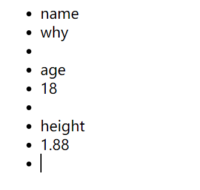

# 7. 列表渲染

- 在真实开发中，我们往往会从服务器拿到一组数据，并且需要对其进行渲染。 
  - 这个时候我们可以使用v-for来完成； 
  - v-for类似于JavaScript的for循环，可以用于遍历一组数据；

## 7.1 v-for的基本使用

- `v-for`的基本格式是 "item in 数组"： 
- 数组通常是来自data或者prop，也可以是其他方式； 
- item是我们给每项元素起的一个别名，这个别名可以自定来定义；
- 我们知道，在遍历一个数组的时候会经常需要拿到数组的索引： 
- 如果我们需要索引，可以使用格式： "(item, index) in 数组"； 
- 注意上面的顺序：数组元素项item是在前面的，索引项index是在后面的；


`示例：`


- `v-for`也支持遍历对象，并且支持有一二三个参数： 
  - 一个参数： "value in object"; 
  - 二个参数： "(value, key) in object"; key表示为属性名
  - 三个参数： "(value, key, index) in object"; index为索引
- `v-for`同时也支持数字的遍历： 
  - 每一个item都是一个数字；

```vue
<div id="app"></div>

  <template id="my-app">
    <h2>电影列表</h2>
    <ul>
      <!-- 遍历数组 -->
      <li v-for="(movie, index) in movies">{{index+1}}.{{movie}}</li>
    </ul>
    <h2>个人信息</h2>
    <ul>
      <!-- 遍历对象 -->
      <li v-for="(value, key, index) in info">{{value}}-{{key}}-{{index}}</li>
    </ul>
    <h2>遍历数字</h2>
    <ul>
      <li v-for="(num, index) in 10">{{num}}-{{index}}</li>
    </ul>
  </template>

  <script src="../js/vue.js"></script>
  <script>
    const App = {
      template: '#my-app',
      data() {
        return {
          movies: [
            "星际穿越",
            "盗梦空间",
            "大话西游",
            "教父",
            "少年派"
          ],
          info: {
            name: "why",
            age: 18,
            height: 1.88
          }
        }
      }
    }

    Vue.createApp(App).mount('#app');
  </script>
```


## 7.2 v-for和template

- 类似于`v-if`，可以使用 `template` 元素来循环渲染一段包含多个元素的内容： 
- 我们使用`template`来对多个元素进行包裹，而不是使用div来完成


`示例：`



```vue
  
  <div id="app"></div>

  <template id="my-app">
    <ul>
      <template v-for="(value, key) in info">
        <li>{{key}}</li>
        <li>{{value}}</li>
        <li class="divider"></li>
      </template>
    </ul>
  </template>

  <script src="../js/vue.js"></script>
  <script>
    const App = {
      template: '#my-app',
      data() {
        return {
          info: {
            name: "why",
            age: 18,
            height: 1.88
          }
        }
      }
    }

    Vue.createApp(App).mount('#app');
  </script>
```

## 7.3`v-for` 与 `v-if`

:::warning 注意 

同时使用 `v-if` 和 `v-for` 是***\*不推荐的\****，因为这样二者的优先级不明显。

 :::  

当它们同时存在于一个节点上时，`v-if` 比 `v-for` 的优先级更高。这意味着 `v-if` 的条件将无法访问到 `v-for` 作用域内定义的变量别名： 

```vue
<!--
 这会抛出一个错误，因为属性 todo 此时
 没有在该实例上定义
-->
<li v-for="todo in todos" v-if="!todo.isComplete">
  {{ todo.name }}
</li>
```

在外新包装一层 `<template>` 再在其上使用 `v-for` 可以解决这个问题 (这也更加明显易读)：

```vue
<template v-for="todo in todos">
  <li v-if="!todo.isComplete">
    {{ todo.name }}
  </li>
</template>
```

## 7.4 数组的修改方法

- Vue 将被侦听的数组的变更方法进行了包裹，所以它们也将会触发视图更新。这些被包裹过的方法包括

  - push() 

  - pop() 

  - shift() 

  - unshift() 

  - splice() 

  - sort() 

  - reverse() 

- 替换数组的方法 
  - 上面的方法会直接修改原来的数组，但是某些方法不会替换原来的数组，而是会生成新的数组，比如 filter()、 concat() 和 slice()

`示例：`

```vue
 <div id="app"></div>

  <template id="my-app">
    <h2>电影列表</h2>
    <ul>
      <li v-for="(movie, index) in movies">{{index+1}}.{{movie}}</li>
    </ul>
    <input type="text" v-model="newMovie">
    <button @click="addMovie">添加电影</button>
  </template>

  <script src="../js/vue.js"></script>
  <script>
    const App = {
      template: '#my-app',
      data() {
        return {
          newMovie: "",
          movies: [
            "星际穿越",
            "盗梦空间",
            "大话西游",
            "教父",
            "少年派"
          ]
        }
      },
      methods: {
        addMovie() {
          this.movies.push(this.newMovie);
          this.newMovie = "";

          // this.movies = this.movies.filter(item => item.length > 2);
        }
      }
    }

    Vue.createApp(App).mount('#app');
  </script>
```

